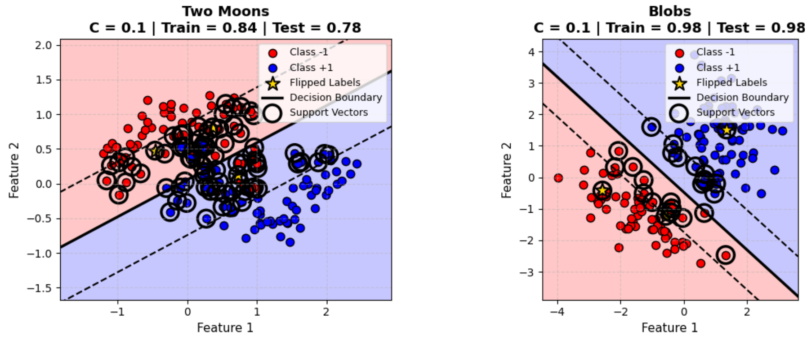
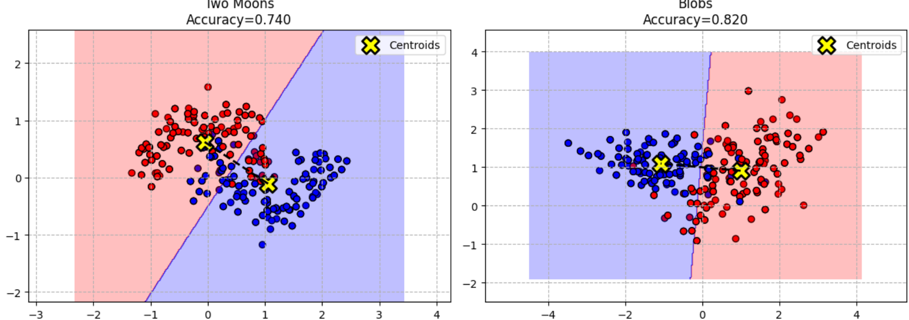

# 🧠 Machine Learning I — Programming Exercise 2
## From Distance-Based Learning to Maximum Margin Classification

<p align="center">


</p>

---

# 📖 Overview

This repository contains my implementation of the second programming exercise from the **Machine Learning I** course.

Rather than relying solely on library functions, the objective was to understand **how two fundamentally different classification algorithms make decisions**.

The exercise progresses through:

- 📍 Linear Support Vector Machines
- 📍 Decision Boundaries & Margins
- 📍 Support Vector Identification
- 📍 Nearest Centroid Classification
- 📍 Decision Surface Visualization
- 📍 Robustness against Outliers

Both models are implemented, visualized and evaluated on synthetic datasets generated using Scikit-Learn.

---

# 🚀 Learning Objectives

This project explores two different philosophies of supervised learning.

### Support Vector Machines

Instead of separating classes based on average positions, SVM searches for the **maximum-margin hyperplane**, improving generalization by maximizing the distance between classes.

### Nearest Centroid Classifier

NCC represents every class using only its centroid and classifies unseen samples based on the closest class center.

Although much simpler than SVM, it provides an intuitive baseline for understanding distance-based classifiers.

---

# 📂 Project Structure

```
Machine-Learning-I-Exercise-2/

│
├── notebook.ipynb
├── README.md
│
└── images/
      ├── svm_results.png
      ├── ncc_results.png
      └── banner.png
```

---

# ⚙️ Algorithms Implemented

## 📌 Linear Support Vector Machine (SVM)

Implemented using Scikit-Learn's linear SVC while manually visualizing every important component.

### Features

- Linear kernel
- Adjustable regularization parameter **C**
- Decision boundary visualization
- Margin visualization
- Automatic support vector identification
- Signed distance computation
- Effect of label flipping (outliers)
- Train/Test accuracy evaluation

---

## 📌 Nearest Centroid Classifier (NCC)

Implemented completely from scratch.

### Features

- Manual centroid computation
- Euclidean distance based classification
- Decision surface visualization
- Class centroid visualization
- Accuracy evaluation
- Comparison against SVM

---

# 🔍 Support Vector Machine

The first part investigates how Support Vector Machines separate two classes by maximizing the margin rather than minimizing classification error alone.

Outliers are intentionally introduced by flipping selected labels, allowing observation of how the decision boundary adapts under different regularization strengths.

---

## 📈 SVM Results

<p align="center">



</p>

### Observations

✅ Decision regions clearly separate the feature space.

✅ Margin lines indicate the maximum-margin separator.

✅ Support vectors alone determine the position of the decision boundary.

✅ Flipped labels become influential support vectors when the regularization parameter is small.

✅ The Blobs dataset is almost perfectly linearly separable, while Two Moons demonstrates the limitations of a linear classifier.

---

# 📍 Nearest Centroid Classifier

The second part investigates an extremely lightweight classifier.

Instead of learning a separating hyperplane, NCC computes one representative point (centroid) for every class and assigns new samples to the nearest centroid.

Although computationally inexpensive, its decision boundary remains linear and depends entirely on the centroid locations.

---

## 📈 NCC Results

<p align="center">



</p>

### Observations

✅ Decision boundaries are defined purely by centroid distances.

✅ Classification remains computationally efficient.

✅ Performs well on linearly separable data.

✅ Performance degrades for complex distributions such as the Two Moons dataset.

✅ Provides an excellent baseline for comparison with more sophisticated classifiers.

---

# 📊 Model Comparison

| Property | Nearest Centroid | Support Vector Machine |
|------------|-----------------|-------------------------|
| Training Complexity | Very Low | Moderate |
| Prediction Speed | Very Fast | Fast |
| Decision Principle | Distance to Centroid | Maximum Margin |
| Handles Complex Boundaries | ❌ | ✔ (with kernels) |
| Robust to Outliers | Low | High (controlled by C) |
| Interpretability | High | High |

---

# 🛠 Technologies Used

<p align="left">


</p>

---

# 💡 Skills Demonstrated

- Machine Learning Fundamentals
- Support Vector Machines
- Distance-Based Classification
- Decision Boundary Visualization
- Margin Maximization
- Euclidean Distance Metrics
- Data Visualization
- Classification Evaluation
- Scientific Computing
- Python Programming

---

# 🌍 Applications

The concepts explored here are widely used in:

- Computer Vision
- Medical Diagnosis
- Intrusion Detection
- Credit Risk Analysis
- Fault Detection
- Pattern Recognition
- Human Activity Recognition
- Industrial AI

---

# 🎯 Key Takeaways

This exercise highlights an important lesson in Machine Learning:

> Different algorithms often solve the same classification problem using completely different mathematical principles.

While the Nearest Centroid Classifier represents each class using only its average position, Support Vector Machines focus exclusively on the most informative samples—the support vectors—to maximize generalization.

Understanding these differences provides valuable intuition before progressing to more advanced models such as kernel methods, ensemble learning and deep neural networks.

---

# 👨‍💻 Author

## Arnav Gurucharan Hoskote

**M.Sc. Informatics**

RPTU Kaiserslautern-Landau 🇩🇪

### Interests

- Artificial Intelligence
- Machine Learning
- Computer Vision
- Human Activity Recognition
- Embedded Intelligence
- Software Engineering

---

<p align="center">

### ⭐ If you found this repository interesting, consider giving it a Star.

</p>
